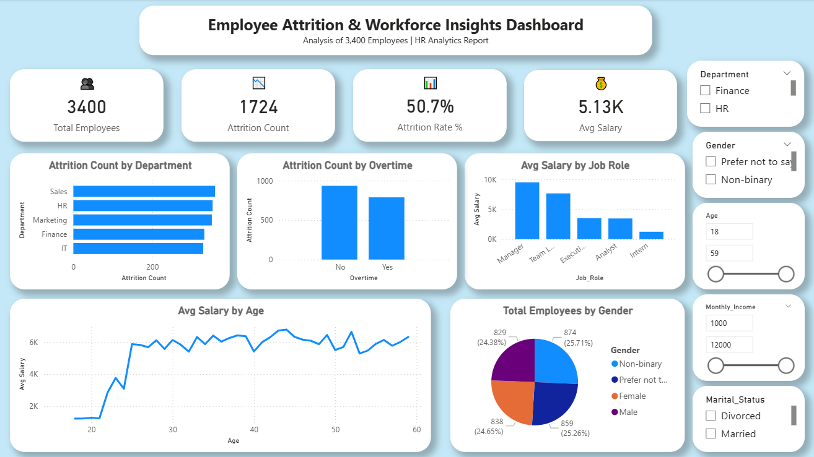

# HR Employee Analysis 📊

## 📌 Project Overview

This project analyzes HR employee data to understand workforce trends and employee behavior.

## 🎯 Objectives

- Analyze employee distribution
- Identify attrition patterns
- Study salary and department trends

## 🔍 Key Insights

- Attrition higher in certain departments
- Salary impacts employee retention
- Experience level affects attrition

## 🛠 Tools Used

- SQL
- Python (Pandas)
- Power BI

## 📊 Dashboard

## 📁 Dataset

HR Employee dataset

## 🚀 Conclusion

This analysis helps organizations improve employee retention and workforce planning.
